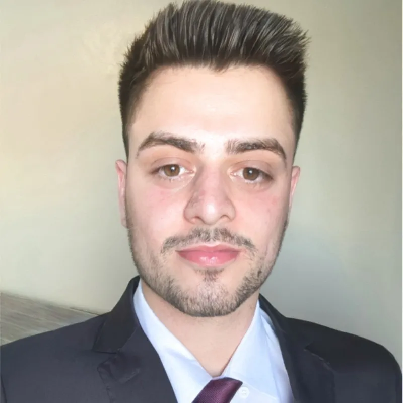

# postech-group-fiap-188

Bem-vindo à organização **postech-group-fiap-188**!

## Sobre nós

A **postech-group-fiap-188** é formada por alunos da Pós-graduação em Arquitetura de Software da FIAP. Trabalhamos juntos nos projetos ao longo da pós em Software Architecture - FIAP, sempre seguindo boas práticas de arquitetura, testes e versionamento de código. Nosso objetivo é criar soluções eficientes, escaláveis e bem documentadas.

## Projetos

Atualmente, nossos repositórios são privados e exclusivos para os integrantes do grupo, garantindo um ambiente seguro e focado para aprendizagem e desenvolvimento.

## Membros

  
  
  
  

  <b>Douglas Vinicius</b> &nbsp; &nbsp;
  <b>Layssa Hillary</b> &nbsp; &nbsp;
  <b>Maicon Pereira</b> &nbsp; &nbsp;
  <b>Thiago Savin</b>

## Como participar

A colaboração está restrita aos membros atuais do grupo. Se você faz parte da turma ou tem interesse em saber mais, entre em contato com um dos integrantes.
